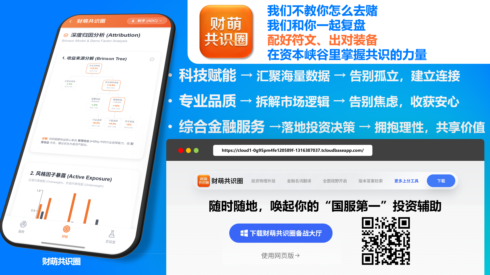
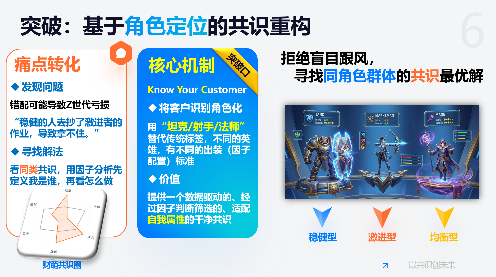
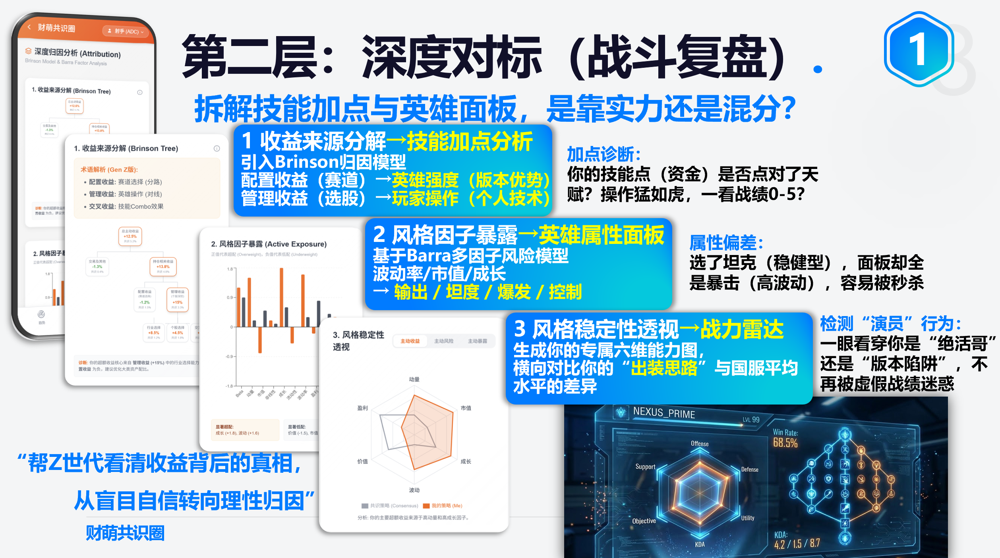
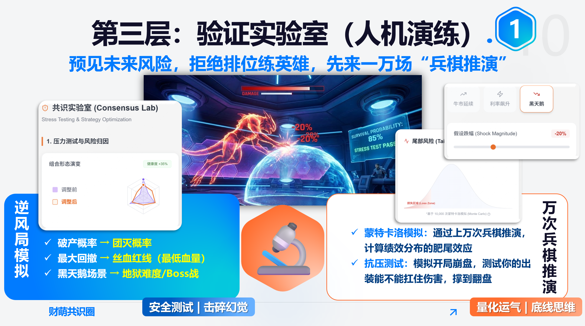
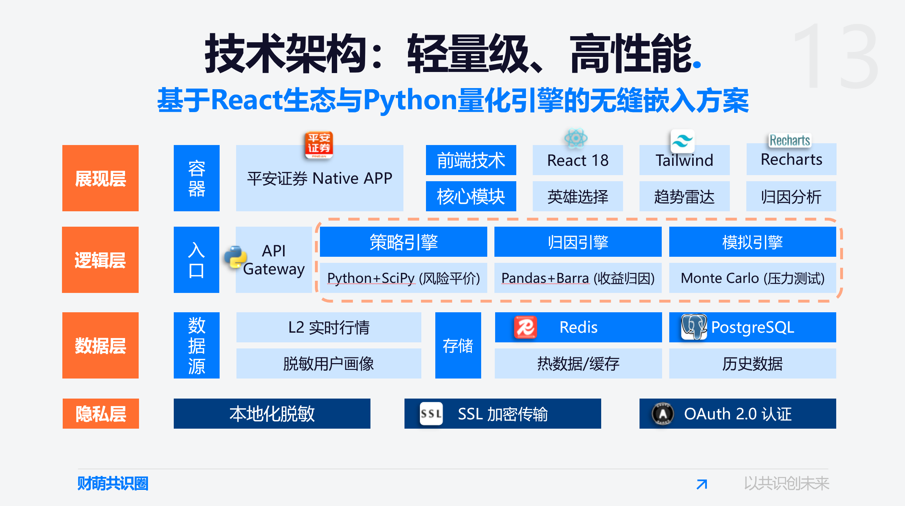

# 🎮 Cai Meng Consensus Circle (财萌共识圈)

> **Gamified Asset Allocation Assistant for Gen-Z Investors** > *Embedded Mini-Program for Ping An Securities App*

## 📖 Executive Summary (项目概述)

**Cai Meng Consensus Circle** is a data-driven "Social Discovery" FinTech product designed for Gen-Z investors. It addresses the pain point of investment anxiety and blindly following trends. 

By translating complex financial logic into **MOBA Gaming Concepts** (e.g., "Tank" for Conservative, "Marksman" for Aggressive), it helps young investors understand their risk profiles, analyze "peer consensus," and conduct professional attribution analysis.

* **Role:** Product Manager & Lead Algo Developer
* **Context:** FinTech Product Design / Ping An Securities User Scenario
* **Key Tech:** Risk Parity Model, Brinson Attribution, Monte Carlo Simulation, React.

---

## 🎯 User Pain Points (用户痛点)

Through user research on Gen-Z investors, we identified three core misalignments:

1.  **Information Overload:** "Too many stock codes, who should I listen to?"
2.  **Risk Mismatch:** Conservative users copying aggressive strategies (FOMO), leading to panic selling.
3.  **Lack of Feedback:** "Winning feels like luck, losing feels like a scam." No professional attribution tools.

> *"We don't teach you how to gamble. We help you replay the game."*

---

## 💡 Product Logic: The "Gaming" Metaphor (核心逻辑)

We redefined the investment journey using concepts familiar to digital natives: **MOBA Games**.

| Investment Concept | Gaming Metaphor | User Value |
| :--- | :--- | :--- |
| **Risk Profile** | **Role (Hero Class)** | Define "Who am I?" (Tank/Marksman/Mage) |
| **Asset Allocation** | **Equipment Build** | "Don't buy naked damage items on a Tank." |
| **Trend Analysis** | **Meta / Tier List** | See what top players of your class are buying. |
| **Stress Testing** | **Battle Simulation** | Simulate 10,000 matches (market crashes). |

  

---

## ✨ Key Features (核心功能)

### 1. Trend Radar & Consensus Discovery (趋势发现)
* **Feature:** Visualizes the "Trend Radar" based on real-time holdings of peer groups.
* **Algo:** Clustering analysis of anonymized user positions.
* **Value:** Helps users identify "Best Sellers" (Consensus) within their specific risk profile (e.g., "What ETFs are other 'Marksmen' buying?").

### 2. Attribution Analysis (深度归因)
* **Feature:** Deconstructs portfolio returns to distinguish between "Luck" (Beta) and "Skill" (Alpha).
* **Algo:** **Brinson Model** & **Barra Risk Factors**.
* **Metric:** Displays "Win Rate," "KDA" (Sharpe Ratio), and "Damage Dealt" (Total Return).

### 3. Stress Testing Lab (验证实验室)
* **Feature:** Before actual trading, users can test their portfolios against extreme scenarios (e.g., "Market Crash," "Interest Rate Hike").
* **Algo:** **Monte Carlo Simulation** (10,000+ iterations).
* **Output:** Calculates "Survival Probability" and "Max Drawdown" (Lowest HP).

### 4. Smart Rebalancing (一键调仓)
* **Feature:** Generates optimized "Equipment Builds" (Portfolios).
* **Algo:** **Risk Parity Model**. Automatically balances "Core Assets" (Fixed Income/Gold) and "Satellite Assets" (Tech/Growth).

---

## 🛠 Technical Architecture (技术架构)

The system is designed with a lightweight frontend and a heavy-duty quantitative backend.

  

### Tech Stack
* **Frontend:** `React 18`, `Tailwind CSS`, `Recharts` (for financial visualization).
* **Backend:** `Python`, `Flask/FastAPI`.
* **Quant Engine:**
    * `Pandas` + `SciPy`: Risk Parity calculation.
    * `Barra Model`: Factor exposure analysis.
    * `Monte Carlo`: Tail risk simulation.
* **Data:** `PostgreSQL` (User Profile), `Redis` (Real-time Market Data).

---

## 📈 Results & Performance (实盘表现)

We backtested and ran the "Conservative Core + Aggressive Satellite" strategy generated by the consensus engine:

* **Period:** Sep 2025 - Nov 2025
* **Return:** **+11.86%**
* **Alpha:** Outperformed CSI 300 (Benchmark) by **+7.55%**.
* **Business Impact:** Transformed traditional "One-way Education" into "Two-way Consensus," improving user retention and rationality.

---
*Disclaimer: This project is a conceptual prototype designed for the Ping An Securities user scenario. Financial data is for demonstration purposes.*
